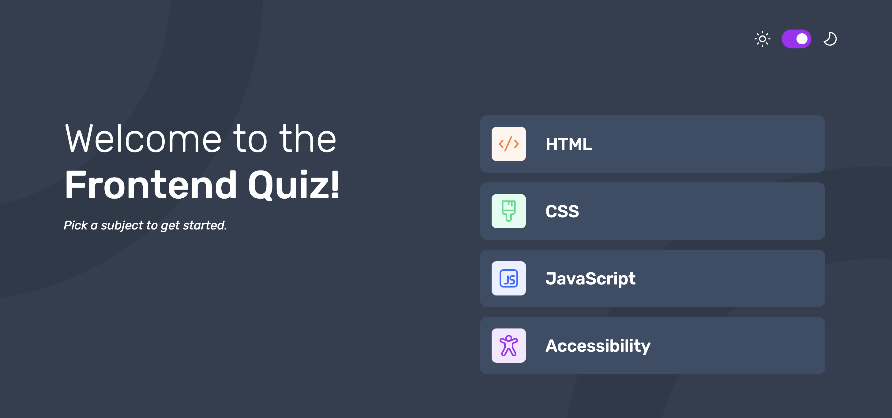

# Frontend Mentor - Frontend quiz app solution

This is a solution to the [Frontend quiz app challenge on Frontend Mentor](https://www.frontendmentor.io/challenges/frontend-quiz-app-BE7xkzXQnU). Frontend Mentor challenges help you improve your coding skills by building realistic projects.

## Overview

### The challenge

Users should be able to:

- Select a quiz subject
- Select a single answer from each question from a choice of four
- See an error message when trying to submit an answer without making a selection
- See if they have made a correct or incorrect choice when they submit an answer
- Move on to the next question after seeing the question result
- See a completed state with the score after the final question
- Play again to choose another subject
- View the optimal layout for the interface depending on their device's screen size
- See hover and focus states for all interactive elements on the page
- Navigate the entire app only using their keyboard
- **Bonus**: Change the app's theme between light and dark

### Screenshot

### Links

- Solution URL: [Add solution URL here](https://your-solution-url.com)
- Live Site URL: [Add live site URL here](https://your-live-site-url.com)

## My process

### Built with

- Semantic HTML5 markup
- Vanilla CSS
- CSS custom properties
- Flexbox
- Mobile-first workflow
- Vanilla JS

### What I learned

Some new important concepts I've been learning while working on this challenge:

- Semantic design tokens and how to update these dynamically with a darkmode switch. This was my first time working with semantic design tokens in a web-project. This also includes using different variations of a background image and how to update the background image dynamically depending on screen size and/or which theme is active.

- Working with async data loading using fetch and async/await. I reinforced and drilled how to work with a data.json file, how promises works and how to initiate an app only when the json data fetching is done and ready for use.

- I drilled and reinforced the concept of state management. In this app there were three main states: the initial menu state, the actual quiz (questions) state, and finally the completed state. And I learned how to work with various render functions based on which state the app is currently in.

- I learnt more about keyboard accessability and focus management; how to use the focus-visible pseudo class in CSS, how to change focus programmatically with the .focus() method combinded with the tabindex="-1" attribute.

- I learnt the importance of always testing your projects across browsers and devices, especially when working with custom styled input-elements and form controls. I learned that especially iOS/Webkit based browsers can be somewhat "stubborn" and tricky when it comes to removing the default input/form control stylings entirely.

### What I'm proud of

I'm proud of the overall feel and flow of this app; Like how the darkmode toggling works using semantic design tokens, as well as how I'm managing and moving between all the various states in this app.

### AI Collaboration

- What tools did you use? -> ChatGPT Codex
- How did you use them? -> For mentor and debugging assistance, used with the agent role instruction provided in AGENTS.md

## Author

- Website - [My GitHub Profile](https://github.com/norwegJan)
- Frontend Mentor - [@norwegJan](https://www.frontendmentor.io/profile/norwegJan)
